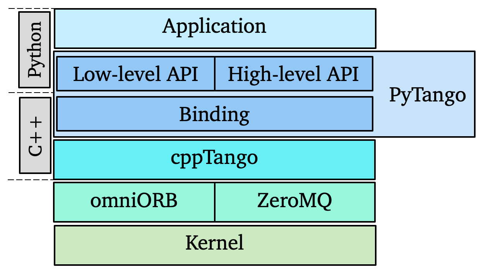
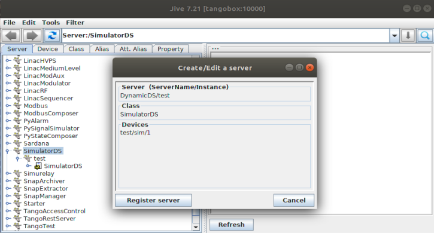
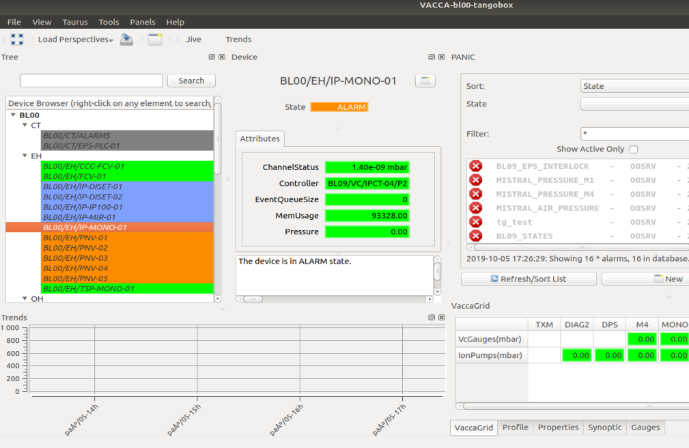
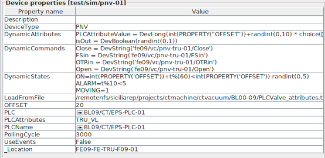
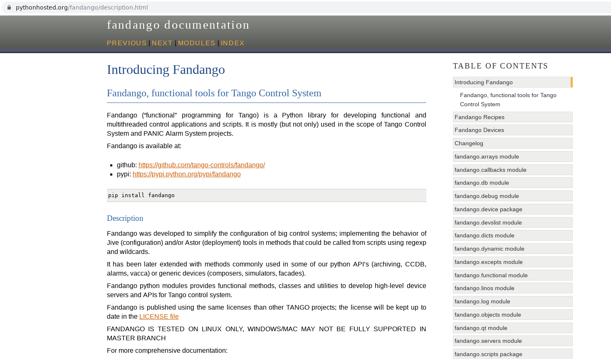

name: empty layout
layout: true

---
name: title
class: center, middle

PyTango and Fandango Workshop
=============================

[Anton Joubert](https://github.com/ajoubertza) ([SARAO](https://sarao.ac.za)) - [Sergi Rubio Manrique](https://github.com/sergirubio) ([ALBA](https://www.cells.es))

ICALEPCS 2019 - New York

*

GitHub: [ajoubertza/icalepcs-workshop](https://github.com/ajoubertza/icalepcs-workshop)

Slides: [https://ajoubertza.github.io/icalepcs-workshop](https://ajoubertza.github.io/icalepcs-workshop)

---
name: acknowledgements
layout: true
class: middle

Acknowledgements
================

---

Some of the content of this presentation is from work by:

* [Vincent Michel](https://github.com/vxgmichel)
* [Tiago Coutinho](https://github.com/tiagocoutinho)
* [Antoine Dupré](https://github.com/AntoineDupre)

Thanks!

---
name: presentation
layout: true
class: middle

What is PyTango?
================

---

* Python library

* Binding over the C++ tango library

* ... using boost-python (future:  pybind11)

* relies on numpy

* Multi OS: Linux, Windows, Mac (with Docker...)

* Works on python 2.7, 3.5, 3.6, 3.7

.center[]

---

... plus some extras:

* Pythonic API

* asyncio and gevent event loop

* ITango (a separate project)

* Experimental TANGO Database server (sqlite backend)

---

name: menu
class: middle
layout: true

What's on the menu?
===================

---

* ITango, a powerful client interface

* Writing tango servers with 15 lines of python

* Testing our servers without a database

* New features being considered

* Fandango - the Swiss army knife

---

### Requirements for this workshop:

* TANGO Box VM
* A tiny bit of Python knowledge

---

name: ITango
layout: true
class: middle

ITango
============

---

### Features

* IPython (jupyter) console

* Direct access to tango classes

* TANGO class sensitive device name auto-completion

* Event monitor

* Qt console

* Notebook

* User friendly error handling

---
### Hands on

``` bash
$ itango
ITango 9.3 -- An interactive Tango client.
Running on top of Python 2.7.15, IPython 5.8 and PyTango 9.3
[...]
```

```python
# `Device` is an alias for `tango.DeviceProxy`
In [1]: dev = Device("sys/tg_test/1")

# or can use class name (limits <tab> search space)
In [2]: dev = TangoTest("sys/tg_test/1")

# is the device running?
In [3]: dev.ping()
API_DeviceNotExported: Device sys/tg_test/1 is not exported
[...]

# No!  Start it, and try again...
In [4]: dev.ping()
Out[4]: 1771

```

---

```python
# send a command (hard way)
In [5]: dev.command_inout('DevShort', 1234)
Out[5]: 1234

# send a command (easy way - PyTango feature)
In [6]: dev.DevShort(1235)
Out[6]: 1235

# read an attribute
In [7]: dev.long_spectrum
Out[7]:
array([0, 0, 0, 0, 0, 0, 0, 0, 0, 0, 0, 0, 0, 0, 0, 0, 0, 0, 0, 0, 0, 0,
[...]
       0, 0, 0, 0, 0, 0, 0, 0, 0, 0, 0, 0, 0, 0], dtype=int32)

# write to it
In [8]: dev.long_spectrum = (1, 2, 3, 4)

In [9]: dev.long_spectrum
Out[9]: array([1, 2, 3, 4], dtype=int32)
```

---

Built-in event monitor - magic `mon` command

```python
In [11]: dev.poll_attribute('State', 1000)

In [10]: mon -a sys/tg_test/1/State
'sys/tg_test/1/State' is now being monitored. Type 'mon' to see all events

In [7]: dev.SwitchStates()

In [9]: mon
ID   Device              Attribute    Value       Quality    Time            
---- ------------------- ------------ ----------- ---------- ---------------
   0 sys/tg_test/1       state        RUNNING    ATTR_VALID  16:52:28.564090
   1 sys/tg_test/1       state        RUNNING    ATTR_VALID  16:52:29.564329
   2 sys/tg_test/1       state        FAULT      ATTR_VALID  16:52:41.564279

In [10]: mon -d sys/tg_test/1/State
Stopped monitoring 'sys/tg_test/1/State'

```

Run `mon?` for more info

---

### End of ITango demo

* Lots more info on this page:  [pythonhosted.org/itango](https://pythonhosted.org/itango/)
* And don't forget it can be used from a Jupyter notebook

---
name: Server
layout: true
class: middle

Wow! Writing device servers has never been so easy!
------------------

---

Device servers with pytango >=9.2.1

```python
from time import sleep
from tango.server import Device, attribute, command

class PowerSupply(Device):

    @attribute(dtype=float)
    def voltage(self):
        return 1.23

    @command
    def calibrate(self):
        sleep(0.1)

if __name__ == '__main__':
    PowerSupply.run_server()
```
See file:  `examples/ps0.py`

`$ git clone https://github.com/ajoubertza/icalepcs-workshop.git`

???

Instead of `Device`, could use `Device_4Impl` or ``Device_5Impl`,
but `Device` preferred as it will always use the latest version.

---

layout: true

---
class: middle

# Testing time!

### Server:

```bash
$ python -m tango.test_context ps0.PowerSupply --host 127.0.0.1
Ready to accept request
PowerSupply started on port 8888 with properties {}
Device access: tango://127.0.0.1:8888/test/nodb/powersupply#dbase=no
Server access: tango://127.0.0.1:8888/dserver/PowerSupply/powersupply#dbase=no
```

### Client:

```python
$ ipython

In [1]: import tango

In [2]: d = tango.DeviceProxy('tango://127.0.0.1:8888/test/nodb/powersupply#dbase=no')

In [3]: d.calibrate()

In [4]: d.voltage
Out[4]: 1.23
```

???
**NOTE:** For events to work with `test_context`, use IP address, not hostname

`$ python -m tango.test_context --help`

For debugging, add `--debug 5`

---
class: middle

Let's try out events!
---------------------

Adding a polled attribute - see file:  `examples/ps0b.py`
```python
import random

[...]

    @attribute(
        dtype=float,
        polling_period=500,  # 0.5 seconds
        rel_change=1e-3)     # 0.1% relative change
    def random(self):
        return random.random()
```
Going back to ipython:

```python
In [5]: cb = tango.utils.EventCallback()

In [6]: eid = d.subscribe_event('random', tango.EventType.CHANGE_EVENT, cb)

2019-09-30 19:06:35.036704 TEST/NODB/POWERSUPPLY RANDOM#DBASE=NO CHANGE
... [ATTR_VALID] 0.34364164896885574

In [7]: d.unsubscribe_event(eid)
```

???
Pity it crashes after about 10 sec!

Works fine on PyTango 9.2.5 with cppTango 9.2.5
Not with 9.3.x

---
class: middle

Enumerated types
----------------

Add an enumerated type - see file:  `examples/ps0c.py`

```python
import enum
[...]

class TrackingMode(enum.IntEnum):
    INDEPENDENT = 0  # must start at zero!
    SYNCED = 1  # and increment by 1

[...]

    @attribute(dtype=TrackingMode)
    def output_tracking(self):
        return TrackingMode.SYNCED
```

```python
In [8]: tracking = d.output_tracking                                                                                       

In [9]: tracking                                                                                                           
Out[9]: <output_tracking.SYNCED: 1>

# matching enum object created on client side
In [10]: type(tracking)                                                                                                     
Out[10]: <enum 'output_tracking'>

In [11]: tracking == tracking.INDEPENDENT                                                                                      
Out[11]: False
```

???
Example is for a dual-output power supply.  They often have the
option of forcing the two outputs to be the same.  I.e., they are
sychronised.

No need to specify labels.
Old syntax: `@attribute(dtype='DevEnum', enum_labels=['A', 'B', 'C'])`
Code is more readable with Python enum objects.

Warnigs:
- The `DeviceProxy` maintains a cache of the attributes, which includes the
enumeration class. If the device server changes the enum_labels for an
attribute that the `DeviceProxy` has already cached, then the DeviceProx
will not know about it. A new instance of the `DeviceProxy` will have to be
created after any significant interface change on the server.
- If a server has enum labels that are not valid Python identifiers it
will cause problems. Leading spaces will break all attribute access for
the `DeviceProxy`. Other invalid labels can be accessed in the IntEnum class
via item lookup, e.g. `proxy.my_enum['has a bad name!']` will work, while
`proxy.my_enum.has a bad name!` obviously won't.

For more example usage see `ClockDS.py` and `client.py`, here:
https://github.com/tango-controls/pytango/tree/develop/examples/Clock

---

class: middle

Unit testing
------------

```python
from tango import DevState
from tango.test_utils import DeviceTestContext

from ps0 import PowerSupply


def test_calibrate():
    """Test device voltage reading after calibration."""
    with DeviceTestContext(PowerSupply, process=True) as proxy:
        proxy.calibrate()
        assert proxy.voltage == 1.23
```
See file:  `example/test_ps0.py`

`DeviceTestContext` launches tango device server in a subprocess,
and returns a `DeviceProxy` instance connected to it. No DB, so
limited functionality.

"Sort-of" unit testing - can test from client's perspective, but
cannot access device's methods or attributes directly.

???

It uses "nodb" mode, but properties can be provided via `properties={}` kwarg.
Set it to a dict of key-value pairs.  A temporary file is created
that is passed to the device server on the command line.

More info:  https://tango-controls.readthedocs.io/en/latest/administration/deployment/without-sql-db.html

---
class: middle

Unit testing
------------

Events are tricky - may need to provide port number too

```python
[...]

def test_events():
    results = []

    def callback(evt):
        if not evt.err:
            results.append(evt)

    port = get_open_port()  # utility function
    with DeviceTestContext(PowerSupply, process=True, port=port) as proxy:
        eid = proxy.subscribe_event("random", EventType.CHANGE_EVENT, callback, wait=True)
        # wait for events to happen
        time.sleep(2)
        assert len(results) > 1
        proxy.unsubscribe_event(eid)
```
See file:  `example/test_ps0b.py`

---
class: middle

Unit testing
------------

```bash
# Once-off, install a test runner
$ pip install pytest

# run the test
$ # pytest -v test_ps0b.py
============================= test session starts ============================
[...]                                                                          

test_ps0b.py::test_calibrate PASSED                                     [ 50%]
test_ps0b.py::test_events PASSED                                        [100%]

============================== 2 passed in 2.58s =============================
```

---
class: middle

Unit testing
------------

`DeviceTestContext(..., process=False)` is the default

If starting device more than once, probably get segmentation fault.

Options:
* `DeviceTestContext(..., process=True)`
* nosetest can use `nose_xunitmp` plugin: `--with-xunitmp`
* pytest can use `pytest-forked` plugin:  `--forked`

---
class: middle

Asynchronous pytango
====================

#### Also called green modes, checkout the docs:

[pytango.readthedocs.io/en/stable/green_modes/green.html](http://pytango.readthedocs.io/en/stable/green_modes/green.html)

```python
tango.GreenMode.Synchronous  # default
tango.GreenMode.Futures
tango.GreenMode.Gevent
tango.GreenMode.Asyncio
```

---
class: middle

Asyncio client mode example
---------------------------

```bash
# Install an asyncio console
$ pip3 install aioconsole
[...]

# Run apython
$ apython
[...]
```

```python
>>> # Import from tango.asyncio
>>> from tango.asyncio import DeviceProxy as asyncio_proxy

>>> # Create proxy
>>> device = await asyncio_proxy('sys/tg_test/1')

>>> # Read attribute
>>> result = await device.read_attribute('ampli')
>>> result.value
1.23
```

---
class: middle

A simple TCP server for tango attributes
----------------------------------------

- Try this [simple TCP server for Tango attributes](https://github.com/tango-controls/pytango/blob/develop/examples/asyncio_green_mode/tcp_server_example.py)

- It runs on all interfaces on port 8888:

    ```bash
    $ python tango_tcp_server.py
    Serving on 0.0.0.0 port 8888
    ```

- It can be accessed through netcat:

    ```bash
    $ ncat localhost 8888
    >>> sys/tg_test/1/ampli
    0.0
    >>> sys/tg_test/1/state
    RUNNING
	>>> sys/tg_test/1/nope
    DevFailed[
    DevError[
         desc = Attribute nope is not supported by device sys/tg_test/1
       origin = AttributeProxy::real_constructor()
       reason = API_UnsupportedAttribute
     severity = ERR]
     ]
    ```

---
class: middle

More resources
--------------

### Asyncio overview

- Slides: [vxgmichel.github.io/asyncio-overview](https://vxgmichel.github.io/asyncio-overview)

- Repo: [github.com/vxgmichel/asyncio-overview](https://github.com/vxgmichel/asyncio-overview)


### Previous PyTango workshop (notes on concurrency)

ICALECPS 2017
- Slides: [vxgmichel.github.io/icalepcs-workshop](https://vxgmichel.github.io/icalepcs-workshop)

- Repo: [github.com/vxgmichel/icalepcs-workshop](https://github.com/vxgmichel/icalepcs-workshop)

---
class: middle
## New features being considered

#### 1. Python logging as standard, sends to TANGO Logging Service (bringing in feature from fandango)

Option 1 - *Opt-in*:  mixin adds `init_logging` method and `_logger` object

```python
    class PowerSupply(Device, LoggerMixin):

        @command
        def calibrate(self):
            self._logger.info('Calibrating...')
```

Option 2 - *Opt-out*:  part of `Device`, disable via overriding `init_logging`

```python
    class PowerSupply(Device):
    [...]
            self._logger.info('Calibrating...')

```

User could add/remove handlers, e.g., syslog or Elastic instead of TLS.

---
class: middle

## New features being considered

#### 2. Support forwarded attributes with `DeviceTestContext`

Currently problem with missing root attribute

#### 3. `faketango.Device` for basic unit testing:

```python
import mock
from tango import DevState
from tango.test_utils import DeviceTestContext
from tango.test_utils import faketango

from powersupply.powersupply import PowerSupply

@mock.patch('tango.server.Device', faketango.Device)
def test_init():
    """Test device goes into STANDBY when initialised"""
    DUT = PowerSupply(properties={})
    DUT.Init()
    assert DUT.get_state() == DevState.STANDBY
```

(This may be difficult, and have limitations - polling, events, green modes, ...)

---
class: middle

PyTango development
-------------------

### Hosting

- Repo: [github.com/tango-controls/pytango](https://github.com/tango-controls/pytango)
- Docs: [pytango.readthedocs.io](https://pytango.readthedocs.io)
- Continuous Integration:  TravisCI, using Conda, Py 2.7, 3.5, 3.6, 3.7
- Windows packages:  AppVeyor (TODO: dedicated `tango-controls` user)

### Issues

- Specific issues:  report on [GitHub](https://github.com/tango-controls/pytango/issues) - the more detail the better
- Questions:  use the [TANGO Forum](https://www.tango-controls.org/community/forum/c/development/python)

### Contributing

- Typical branched Git workflow.  Main branch is `develop`
- Fork the repo, make it better, make a PR.  Thanks!
- More info in [how-to-contribute](https://pytango.readthedocs.io/en/latest/how-to-contribute.html).

---
class: middle

PyTango versions
----------------

`pip install pytango != apt get-install python-tango`

- PyPI has the latest
  - but binding extension not compiled for Linux
  - binding is compiled and statically linked for Windows
- Linux packages
  - The binding is already compiled code, so quick to install.
  - Typically a few versions behind.

---
class: middle

Done!  Any questions?
---------------------

---
name: fandango
layout: true
class: center, middle

---

Fandango - a Swiss army knife for tango
=======================================
ICALEPCS 2019 - New York
[Sergi Rubio Manrique](https://github.com/sergirubio)ICALEPCS 2019 - New York

ICALEPCS 2019 - New York

---
name: whatis
class: middle
layout: true

What is Fandango?
=================

---
class: middle

* a Python library:  pip install fandango

* and a shell script: fandango read_attribute test/dyn/1/t

* https://github.com/tango-controls/fandango

* uses PyTango and DatabaseDS and Starter Device Servers

---
class: middle

It originated from 2 motivations:

* provide a library with utilities/templates for PyTango devices at ALBA

* the desire to get completely rid of Java applications (Jive and Astor)

---
class: middle

It provides many features:

* the origin, functional programming for tango (fun4tango)

* features from Java clients (Jive, Astor)

* utilities for python devices (Logging, Threading, Workers)

* includes methods for functional programming

* enables middle-layer devices (DynamicDS, SimulatorDS, CopyCatDS)

---
name: empty2
layout: true
class: middle

---

fandango submodules
===================

* functional: functional programming, data format conversions,
    caseless regular expressions
* tango : tango api helper methods, search/modify using regular expressions
* dynamic : dynamic attributes, online python code evaluation
* server : Astor-like python API
* device : some templates for Tango device servers
* interface: device server inheritance
* db: MySQL access
* dicts,arrays: advanced containers, sorted/caseless list/dictionaries,
    .csv parsing
* log: logging
* objects: object templates, singletones, structs
* threads: serialized hardware access, multiprocessing
* linos: accessing the operative system from device servers
* web: html parsing
* qt: some custom Qt classes, including worker-like threads.


---

fandango.tango submodules
=========================

* command: asynchronous execution of tango commands on a background thread
* eval/tangoeval: evaluation of formulas using tango attribute values
* dynattr: dynamic typing of attributes, used to override operators on demand
* export: import/export tango attributes/devices/properties on json/pickle formats
* search: methods to search devices/attributes in the tango database or a running control system
* methods: miscellaneous methods to access Tango devices and attributes

---
title: vs
class: middle
layout: true

fandango vs PyTango
===================
---

PyTango is a binding of TANGO C++, thus bringing the same functionality and 
mimicking the same methods and arguments available on C++.

The PyTango High Level API provides a pythonic API for developing
TANGO device servers and clients in Python 3.

fandango instead, extends the API adding some features only available on Java
clients like Jive and Astor, the  default management UI applications of TANGO.

---

Adding a new device with *PyTango* (mimics the C++ API):

```python
add_device(self, dev_info) -> None

        Add a device to the database. The device name, server and class
        are specified in the DbDevInfo structure

        Example :
            dev_info = DbDevInfo()
            dev_info.name = 'my/own/device'
            dev_info._class = 'MyDevice'
            dev_info.server = 'MyServer/test'
            db.add_device(dev_info)

    Parameters :
        - dev_info : (DbDevInfo) device information
```

---

Adding a new device with *fandango* (mimics the Jive UI form):

```python
fn.tango.add_new_device(server, klass, device)

This methods mimics Jive UI forms:

    server: ExecutableName/Instance
    klass:  DeviceClass
    device: domain/family/member
    
e.g.:
    fandango.tango.add_new_device(
      'MyServer/test','MyDevice','my/own/device')
```
---
title: creating
layout: true
class:middle

fandango.tango: creating and launching devices
----------------------------------------------

---

fandango provides Astor python API, providing the same functionality than astor tool.

fandango can be used in python:
```python
import fandango as fn

fn.tango.add_new_device('DynamicDS/1','DynamicDS','test/dyn/1')
astor = fn.Astor()
host = fn.linos.MyMachine().hostname
astor.start_servers('DynamicDS/1',host=host)
astor.set_server_level('DynamicDS/1',level=3,host=host)
```

---

.center[]

---

methods from fandango can  also be launched linux shell:

```bash
$: fandango add_new_device DynamicDS/1 DynamicDS test/dyn/1

$: fandango put_device_property test/dyn/1 DynamicAttributes "T=t%10"

$: tango_servers $HOSTNAME start DynamicDS/1
```

---

```bash

tango-cs@tangobox:~$ fandango find_devices "*hdb*es*"

dserver/hdb++es-srv/1

tango-cs@tangobox:~$ tango_servers start $(fandango find_devices "*hdb*es*")

start of ['dserver/hdb++es-srv/1'] at *
Loading dserver/hdb++es-srv/1 devices

Starting : ['hdb++es-srv/1']
--------------------------------------------------------------------------------
/home/tango-cs/.local/bin/tango_servers start dserver/hdb++es-srv/1: Done

tango-cs@tangobox:~$ 

```

---
class: middle
layout: true
fandango.tango: searching in the database
-----------------------------------------

---

```python

fandango.find_devices('bo01/vc/*')

fandango.find_attributes('sr12*/*plc*')

fandango.get_matching_device_properties('sr12/vc/eps-plc-01','dynamic*')

```

---


```bash
$ fandango -l find_devices "bl00/*"

bl00/ct/alarms
bl00/ct/ccdalarms-01
bl00/ct/eps-plc-01
bl00/ct/eps-plc-01-mbus
bl00/door/01
bl00/door/02
bl00/door/03
bl00/eh/ccg-fcv-01
bl00/eh/diset-01-ccd
bl00/eh/diset-01-iba
bl00/eh/diset-02-ccd
bl00/eh/diset-02-iba
bl00/eh/fcv-01
bl00/eh/ip-diset-01
bl00/eh/ip-diset-02
bl00/eh/ip-ip100-01
```

---
layout: true
Import/Export Device servers from TANGO Db
------------------------------------------

---

.center[]

---

Exporting/Importing devices and properties declaration allows to easily
create/move hundreds of devices with a few commands:

```bash

$ tango2json --commands --properties --attributes ../bl00.json "(bl00|fe00)*"

Exporting 58 devices to ../bl00.json

$ ls -lah bl00.json 
-rw-r--r-- 1 tango-cs tango-cs 1,4M paź  5 17:12 bl00.json

```

---

```python
import fandango as fn

jj = fn.json2dict('/home/tango-cs/src/bl00.json')

[fn.tango.import_device_from_dict(d) for d in jj.values()]
```

---

```
tango-cs@tangobox:~/src$ DynamicDS bl09_as_00

Launching /home/tango-cs/src/fandango.git/fandango/device/DynamicDS bl09_as_00

screen -dm -S DynamicDS-bl09_as_00 python 
  /home/tango-cs/src/fandango.git/fandango/device/DynamicDS.py bl09_as_00
```

---

although csv is less popular, tango2csv allows human-readable exports

```
$ tango2csv "(bl00|fe00)*" bl00.csv &

$ less bl00.csv

DynamicDS/bl09_as_00    SimulatorDS     bl00/eh/ip-diset-01
                        Channel P2
                                HV2Status
                                State
                        IonPumpController       BL09/VC/IPCT-02
                        LoadFromFile    /remotenfs/siciliarep/projects/ctmachine/ctvacuum/BL00-09/IonPump_attributes.txt
                        LowRange        1e-12
                        OFFSET  34
                        PollingCycle    3000
                        UseEvents       False
                        _Location       BL09-DI-D
```
---

title: eval
class: middle
layout: true
Evaluating attribute values on runtime
======================================

---

fandango provides two implementations for evaluating python code for attributes:

 * DynamicDS: device template for creating attributes dynamically using properties,
 optimized for reading hundreds of attributes, implementing  caches and hierarchic evaluation.
 
 * TangoEval: generic python evaluator object with Tango syntax parsing, it can
 be used from either devices or clients

---

Declaring Dynamic Attributes on a simulator/composer/processor device:
```python

PLCAttributeValue = DevLong(int(PROPERTY("OFFSET"))+randint(0,10) * choice([0, 1] or [0]))

CCGPressures=DevVarDoubleArray([XAttr('BL00/VC/VGCT-%02d/P%d'%(j,i)) or 1e-12 for j in (3,2,1) for i in (2,1)])

MaxPressure=DevDouble(max(CCGPressures))
```

---

.center[]

---

Declaring a formula in the PANIC Alarm System (using fandango.TangoEval):
```python

BL00_AIR_PRESSURE:
    BL00/CT/EPS-PLC-01/PAAS_EH01_01_PS1<=4 or BL00/CT/EPS-PLC-01/PAAS_EH01_01_PS2<=4
    
BL09_STATES:
    any([s<0 or str(s) in ('UNKNOWN','FAULT') for s in 
      FIND(BL00/VC/ALL/State)+FIND(BL00/VC/VGCT-0*/State)
      +FIND(BL00/VC/IPCT-0*/State)])
      
BL09_START:
    BL00/VC/Elotech-01/Temperature_Max > 20 

BL00_PRESSURES:
    any([p>8e-07 for p in BL00/VC/ALL/CCGPressures[1:]])
```

---

class: middle
layout: true

Libraries/Projects using fandango
=================================

---

* SimulatorDS Device Server
* CopyCatDS, ComposerDS, PyStateComposer, PyAttributeProcessor, ...
* PANIC Alarm System: [https://github.com/tango-controls/panic]
* PyTangoArchiving
* PyPLC Device Server
* VacuumController Device Servers (Varian, Agilent, MKS, Pfeiffer)
* VACCA User Interface

---
layout: true
name: empty
class: middle
---
class: middle

Fandango and VACCA
------------------

.center[]

VACCA is an SCADA-like UI build on top of the Taurus (PyQt) library with the purpose
of managing all TANGO related services (Archiving, Alarms, TANGO Db, Hosts) from a single
application.

---
class: middle

Plenty of useful methods:

```python
$ fandango --list

...
fandango.tango.methods.check_attribute
fandango.tango.methods.check_attribute_cached
fandango.tango.methods.check_attribute_events
fandango.tango.methods.check_device
fandango.tango.methods.check_device_cached
fandango.tango.methods.check_device_events
fandango.tango.methods.check_device_list
fandango.tango.methods.check_host
fandango.tango.methods.check_property_extensions
fandango.tango.methods.check_starter
fandango.tango.methods.delete_device
fandango.tango.methods.device_command
fandango.tango.methods.get_alias_dict
fandango.tango.methods.get_alias_for_device
fandango.tango.methods.get_attr_name
fandango.tango.methods.get_attribute_config
fandango.tango.methods.get_attribute_events
...
```

---

Fandango documentation
----------------------

https://pythonhosted.org/fandango

.center[]

---

What is missing?
----------------

The most requested feature:

* PyTango 3

Which is currently blocked by:

* Testing and CI

Two ports to python 3 actually exist (one by me and another from S2Innovation),
but none of them has been yet put in production.

---

layout: true

Deploying taurus-test docker
----------------------------

Reproducing examples with taurus docker (also AWS available)

```bash
https://docs.docker.com/install/linux/docker-ce/debian/#install-using-the-repository

sudo apt-get install docker-ce docker-ce-cli containerd.io
sudo usermod -aG docker your-user
docker run -id --name=taurus-stretch -h taurus-test -e DISPLAY=$DISPLAY -e QT_X11_NO_MITSHM=1 -v /tmp/.X11-unix:/tmp/.X11-unix cpascual/taurus-test:debian-stretch
docker exec -it taurus-test bash
 
root@taurus-test:~# fandango add_new_device Starter/$HOSTNAME Starter tango/admin/$HOSTNAME
None
root@taurus-test:~# fandango put_device_property tango/admin/$HOSTNAME StartDSPath $(fandango findModule fandango)/devices
StartDSPath /root/fandango/devices
root@taurus-test:~# /usr/lib/tango/Starter taurus-test &
```
